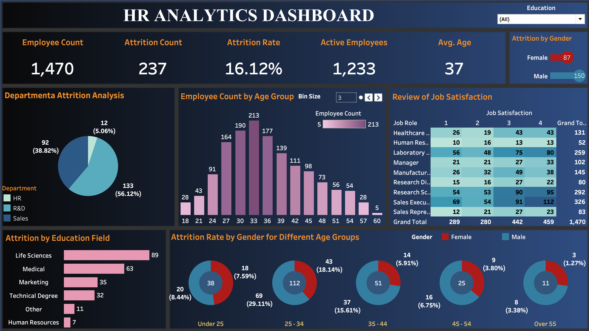

# 🧠 HR Analytics Dashboard (Tableau)

This Tableau dashboard provides a deep-dive into employee attrition using HR data sourced from Kaggle. It offers actionable insights into turnover patterns by department, education field, gender, age, and job satisfaction levels.

## 📊 Key Metrics & Visuals

- **Employee Overview**: Total headcount, active employees, attrition count and rate.
- **Attrition Analysis**:
  - By Department (HR, R&D, Sales)
  - By Gender (Male vs. Female)
  - By Education Field (Life Sciences, Medical, etc.)
  - By Age Group (Histogram + Donut charts)
- **Job Satisfaction Heatmap**:
  - Satisfaction scores across different job roles

## 📂 Project Structure

| Folder | Description |
|--------|-------------|
| `dashboard/` | Tableau packaged workbook (`.twbx`) |
| `data/` | Source dataset (from Kaggle, cleaned) |
| `images/` | Visual previews (for documentation and GitHub display) |

## 🗃️ Dataset Source

- 📁 File: [`HR_dataset.xlsx`](data/HR_Data.xlsx)
- Format: xlsx 
- Records: 1,470 employees  
- Note: Data used is **non-confidential** and publicly available

## 🚀 How to View

1. Download the `.twbx` file from the `dashboard/` folder.
2. Open using **Tableau Desktop** or **Tableau Public**.
3. Use filters to explore attrition trends and role-based insights.

## 🌐 Optional: View Live on Tableau Public

> Coming soon! (If you upload to Tableau Public, update this with your link)

## 👩‍💻 About Me

**Smruti**  
Business Analytics Undergraduate | Tableau Enthusiast | Data Storyteller  
[LinkedIn](https://www.linkedin.com/in/iamsmrutip28/) • [Portfolio](https://your-site.com)

---

## ⭐ Highlights

- Combines descriptive analytics with data storytelling
- Clean, executive-friendly layout
- Built for HR managers to identify key attrition risk factors
